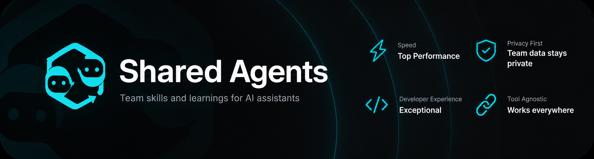

<p align="center">
  <!-- Replace with your banner (recommended: 1200×400, docs/assets/shared-agents-banner.png) -->
  
</p>

---

<p align="center">
  <strong>Team skills, rules, and learnings for AI assistants</strong> — one install, Git-synced, IDE-agnostic.
</p>

<p align="center">
  <a href="https://github.com/netgrade-digital/shared-agents/actions/workflows/ci.yml"></a>
  <a href="https://github.com/netgrade-digital/shared-agents/releases"></a>
  <a href="LICENSE"></a>
  <a href="https://github.com/netgrade-digital/shared-agents/stargazers"></a>
</p>

<p align="center">
  If this project helps your team, consider giving it a <a href="https://github.com/netgrade-digital/shared-agents/stargazers">⭐ on GitHub</a>.
</p>

---

## Why this exists

Teams use many AI tools (Cursor, Claude Code, Zed, Codex, …). Each session starts cold: no shared workflows, no institutional memory, and knowledge trapped in chats or private notes.

**Shared Agents** gives you one place to:

- **Skills** — how we work (repeatable workflows for agents)
- **Rules** — shared instructions per tool (Cursor `.mdc`, others via `AGENTS.md` / `CLAUDE.md`)
- **Learnings** — what we already figured out (bugs, stack quirks, decisions)

Everyone syncs the same content. Agents load it automatically at session start. Sensitive team data stays in a **private** repo, not public.

---

## What it is

| Piece | Role |
|-------|------|
| **Core** (this repo) | Open-source CLI (`sa`), adapters, shared skills, installer |
| **Team** (your private Git remote) | Learnings, team rules, and team-only skills under `team/` |
| **Local install** | `~/.shared-agents` (or `$SHARED_AGENTS_HOME`) on each machine |

```
  GitHub (Core)              Your private remote (Team)
        │                              │
        └────────── sa sync ───────────┘
                        │
                        ▼
              ~/.shared-agents  ──►  Cursor · Claude Code · Zed · …
```

- **Tool-neutral** — Markdown + Git, no vendor lock-in
- **Manifest-driven adapters** — hooks and global instructions per IDE/CLI
- **Human-in-the-loop learnings** — agents propose drafts; a person approves via `sa review`
- **Team rules like skills** — flat `team/rules/*.mdc`; manage with `sa skill` / `sa rule`; teammates `sa sync`

---

## Quick start

```bash
curl -fsSL https://raw.githubusercontent.com/netgrade-digital/shared-agents/refs/heads/main/scripts/bootstrap.sh | bash
```

The bootstrap wizard installs Core, optionally wires your team repo, and configures detected tools. Then open a new shell and run `sa`.

Non-interactive (CI/scripts): `SA_BOOTSTRAP_NON_INTERACTIVE=1 curl -fsSL … | bash`

---

## Everyday use

| Task | Command |
|------|---------|
| Pull latest Core + team; link skills + rules | `sa sync` |
| Fix symlink / rule link issues | `sa doctor --fix` |
| Overview / all commands | `sa` or `sa help` |
| First-time adapter setup (hooks, base blocks) | `sa install` |
| Adapter health | `sa check` |
| Review a learning draft | `sa review` |
| List team skills / rules | `sa skill list` · `sa rule list` |
| Create team skill / rule (wizard) | `sa skill new` · `sa rule new` |
| Remove team skill / rule | `sa skill rm [name]` · `sa rule rm [slug]` |

### What `sa sync` does

After pulling Core + team (ff-only):

1. **Skill symlinks** — `skills/` + `team/skills/` → `~/.agents/skills`, `~/.claude/skills`, …
2. **Rule symlinks** — Cursor: `rules/` + `team/rules/` → `~/.cursor/rules/`
3. **Team-rules blocks** — Zed, Codex, Claude Code, Gemini, Windsurf, …: `<!-- shared-agents:team-rules:begin/end -->` in each tool's `AGENTS.md` / `CLAUDE.md`

Also runs quietly via IDE session hooks where configured. **`sa install`** is still required once per tool (hooks, base `<!-- shared-agents:begin -->` block).

### Team content (skills & rules)

Lives in your **private team repo** under `team/skills/` and `team/rules/` — not in Core PRs. No pending/review workflow (unlike learnings).

```bash
sa skill new          # wizard → team/skills/<name>/SKILL.md
sa rule new           # wizard → team/rules/<slug>.mdc
sa skill rm [name]    # remove (picker if name omitted)
sa rule rm [slug]
```

Create/remove wizards **commit + push by default** (Enter = yes; `--no-git` to skip). Then teammates run **`sa sync`**.

**Dev checkout:** `./sa sync` from this repo uses scripts from the clone (even before `~/.shared-agents` is updated). Shell alias `sa` uses `$SHARED_AGENTS_HOME/scripts/` — refresh with `./sa install` after pulling Core changes.

---

## Repository layout

```
shared-agents/
├── skills/              # Core skills (synced to ~/.agents/skills, etc.)
├── rules/               # Core rules (.mdc) — Cursor symlinks + AGENTS.md merge
├── adapters/            # Per-tool wiring (manifest.json + docs)
├── scripts/             # sa CLI, sync, bootstrap, learning tools
├── docs/                # Detailed guides
└── team/                # Private team data (gitignored here — separate remote)
    ├── learnings/       # pending/ + approved/ (review via sa review)
    ├── rules/           # flat *.mdc (like team/skills/)
    └── skills/
```

Install path defaults to `~/.shared-agents`. Team data lives under `team/` inside that directory.

---

## Documentation

| Topic | Guide |
|-------|--------|
| Overview | [docs/overview.md](docs/overview.md) |
| Installation | [docs/installation.md](docs/installation.md) |
| CLI reference | [docs/cli-reference.md](docs/cli-reference.md) · `sa help` |
| Skills & rules | [docs/skills-and-rules.md](docs/skills-and-rules.md) |
| Learnings workflow | [docs/learnings.md](docs/learnings.md) |
| Canonical paths | [docs/canonical-paths.md](docs/canonical-paths.md) |
| Adapters | [docs/adapters.md](docs/adapters.md) |
| Team setup | [docs/team-setup.md](docs/team-setup.md) |
| Troubleshooting | [docs/troubleshooting.md](docs/troubleshooting.md) |
| Contributing | [CONTRIBUTING.md](CONTRIBUTING.md) · [docs on website](docs/) |
| Shared MCPs (draft) | [docs/shared-mcps.md](docs/shared-mcps.md) |
| Migrate legacy `learnings/` | [docs/migration-team-data.md](docs/migration-team-data.md) |

---

## Contributing

Contributions to **Core** (adapters, CLI, docs, shared skills, shared rules) are welcome. Team learnings and team rules belong in your **private team repo**, not in pull requests here.

See [CONTRIBUTING.md](CONTRIBUTING.md).

---

## License

[MIT](LICENSE) — maintained by [netgrade-digital](https://github.com/netgrade-digital).

---

## Star History

<a href="https://www.star-history.com/?repos=netgrade-digital%2Fshared-agents&type=date&legend=top-left">
 <picture>
   <source media="(prefers-color-scheme: dark)" srcset="https://api.star-history.com/chart?repos=netgrade-digital/shared-agents&type=date&theme=dark&legend=top-left" />
   <source media="(prefers-color-scheme: light)" srcset="https://api.star-history.com/chart?repos=netgrade-digital/shared-agents&type=date&legend=top-left" />
   
 </picture>
</a>
